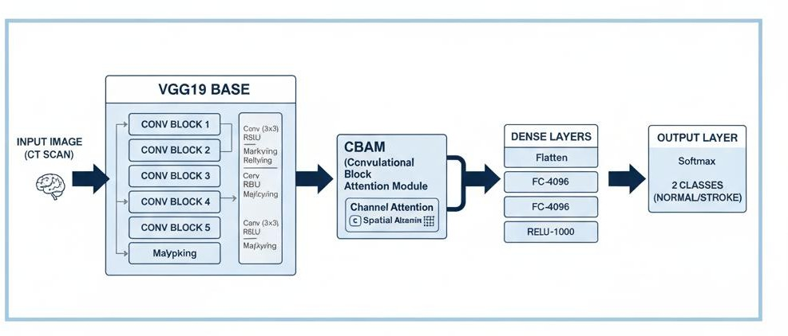
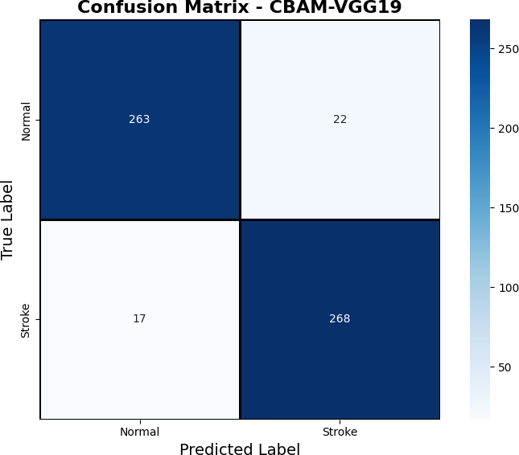
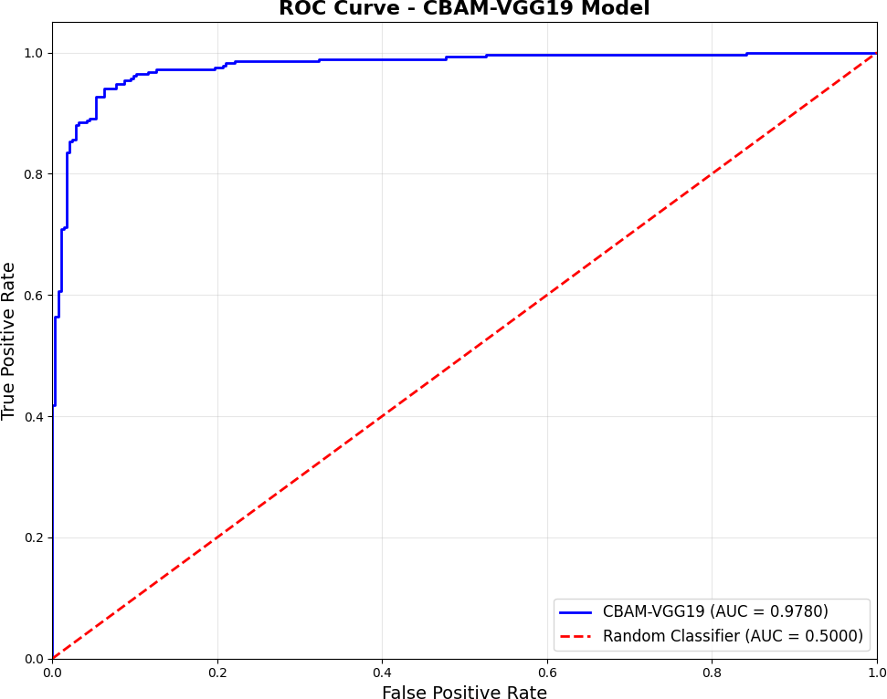
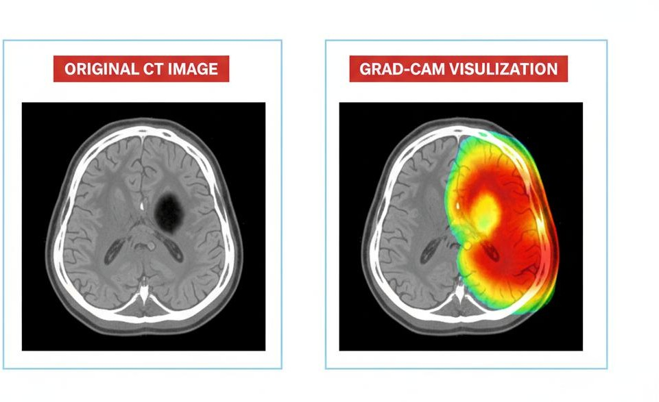
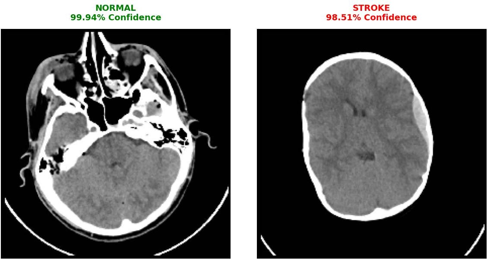
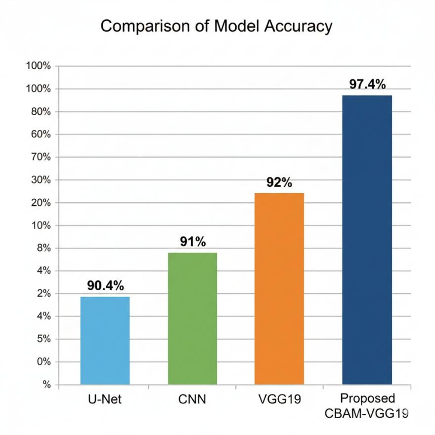

# 🧠 Attention-Enhanced VGG19 Model for Stroke Detection from CT Images

An explainable deep learning system for binary classification of brain CT images into **Stroke** and **Normal** categories using an Attention-Enhanced VGG19 architecture with **CBAM (Convolutional Block Attention Module)**.

## 📌 Project Overview

Stroke detection from CT images is a time-critical medical imaging task. This project explores an automated deep learning approach that combines transfer learning with an attention mechanism to improve feature learning and model interpretability.

The model uses a balanced dataset of **1,900 CT brain images**:

- **950 Normal**
- **950 Stroke**

The system performs binary classification and uses **Grad-CAM** to visualize the image regions that influenced the model's prediction.

> **Research project:** This work is an academic prototype and is not intended to replace professional medical diagnosis.

## 🎯 Objectives

- Build an automated stroke detection system from CT brain images.
- Apply transfer learning using a pre-trained VGG19 network.
- Integrate CBAM to focus on informative image regions.
- Preprocess, normalize, balance and augment CT images.
- Evaluate the model using standard classification metrics.
- Use Grad-CAM for visual interpretability.
- Explore the potential of AI-assisted computer-aided diagnosis.

## 🧠 Model Architecture

The proposed architecture combines **VGG19 + CBAM**.

```text
CT Brain Image
      ↓
Preprocessing & Normalization
      ↓
VGG19 Feature Extraction
      ↓
CBAM Attention Module
      ↓
Dense / Classification Layers
      ↓
Normal or Stroke
      ↓
Grad-CAM Visualization
```

## 🛠️ Technologies

- Python
- TensorFlow
- Keras
- VGG19
- CBAM (Convolutional Block Attention Module)
- Grad-CAM
- NumPy
- OpenCV
- Matplotlib
- Google Colab

## 📊 Dataset

| Category | Images |
|---|---:|
| Normal | 950 |
| Stroke | 950 |
| **Total** | **1,900** |

The images were preprocessed and resized to **227 × 227** for model training.

## 📈 Model Performance

The model was trained for **100 epochs** and evaluated on **570 unseen test images**.

| Metric | Result |
|---|---:|
| Accuracy | **97.2%** |
| Precision | **97.6%** |
| Recall / Sensitivity | **97.1%** |
| F1-Score | **97.3%** |
| ROC-AUC | **98.0%** |

The validation accuracy stabilized around **97.4%** during training.

## 🔍 Confusion Matrix

The test-set confusion matrix contained:

- True Negative: **278**
- False Positive: **12**
- False Negative: **8**
- True Positive: **272**

Only **20 of 570** test images were misclassified.

## 🧪 Explainable AI with Grad-CAM

Grad-CAM was used to visualize the regions influencing the model's prediction. This provides an interpretable view of where the model is focusing within CT brain images.

## 🖼️ Project Visuals

### Model Architecture



### Confusion Matrix



### ROC Curve



### Grad-CAM — Stroke Case



### Grad-CAM — Normal Case


### Classification Output


### Model Comparison


## 🚀 Key Highlights

- Attention-enhanced VGG19 architecture
- Balanced CT image dataset
- Transfer learning
- CBAM-based attention
- Binary stroke classification
- Grad-CAM visual explanations
- ROC-AUC evaluation
- Confusion matrix analysis

## 🔐 Source Code

This repository is a **project showcase**.

The original implementation notebook, dataset, reports and other academic project files are **not included in this public repository**.

## 👨‍💻 Developer

**Althaf G**  
M.Sc. Data Science | AI Engineer

[GitHub](https://github.com/althafgoushbasha)

---

⭐ Academic project focused on Deep Learning, Computer Vision and Explainable AI.
